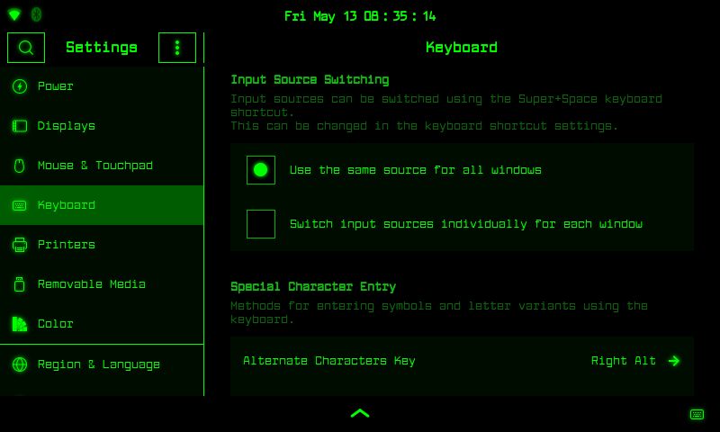

# Amoled theme for mobile devices

This KDE (colour/plasma/desktop/decoration) theme was made for the wayland KDE display manager.

Features:
- Enlarged buttons, switches, bars, borders, text... for easier touch access
- Thicker scroll bars and sliders
- Panel widget (active window control) provides close and maximize/restore buttons (must be manually added to panel)
- Pure black background for low battery consumption on amoled devices
- A gnome 3.0 theme for those who want to run gnome within KDE (not being updated due to libadwaita breaking things)
- Border size (except plasma borders) can be easily be adjusted from no borders to any thickness
- Dual colour, high-contrast appearance for easy viewing in day/night

This theme has been tested on the Raspberry Pi 4b architecture using the 7" official Raspberry Pi touchscreen on the Phosh and KDE Manjaro images. It has also be tested on Manjaro x86-64 KDE. It has not been tested on the X window manager!


## Requirements:

Packages required:

kvantum

## Installation

```
git clone https://github.com/bathtime/amoled.git
cp -rv amoled/.* ~
```

Please note that any changes to ~/.config/gtk-3.0/gtk.css will not be seen until the user logs out and back into gnome and that this installation will overwrite your previus gtk.ss config file.


## KDE Screenshots
 
clean desktop:


dirty desktop (note the close and maximize/restore buttons in the upper right corner):


dolphin:


kate:


konsole:

 
launcher:


## Gnome Screenshots

These shots have been taken from Manjaro's ARM Phosh image for Raspberry Pi:





Themes may be set to any colour by simply editing a [gtk.css](.themes/phosh-red/gtk-3.0/gtk.css) file:


A cyan theme was created by editing [~/.themes/phosh-cyan/gtk-3.0/gtk.css](.themes/phosh-cyan/gtk-3.0/gtk.css):


Themes may be reverse-colours:


## Credits

Larabie font came from: https://www.1001freefonts.com/larabie-font.font

UbuntuTouch Tron icon themes: https://www.gnome-look.org/p/1463203/


## GTK Bugs:

- GTK4 Libadwaita theme not currently working as it should (.config/gtk-4.0/gtk.css)
- The lockscreen is not completely edited and finished. I've edited the lockscreen to make the pin entry fit as well as I can on my official Raspberry Pi touchscreen. You will be able to enter your pin, but you'll need to press the keyboard button and then <ENTER> to submit the password, as the submit button won't fit on the screen in landscape mode.
- The main overview search bar appears to use white text. I've not yet figured out how to change this. The workaround is to use a text shadow to wash it out a little and make it more closer to the foreground colour.
- The program gnome-disks for some reason uses a strange configuration of colours which results in the program looking washed out at times. I'm going to look into this.
- Highlighted buttons will sometimes not unhighlight. I'm not sure if this is due to my gtk.css configuration, gnome's gtk, wayland, or phosh.
- Firefox can incorperate the colours of the theme but will not allow for certain dark shades. A black background will result in a dark greyish colour instead. There is a way to fix this, I believe, but it involves some sort of trick using transparency and solild colours to fool firefox or just simply using a colour light enough for firefox to accept.
- This theme was created mainly using a touch device. It should work with a keyboard, but some items may not draw a dotted outline when using the <TAB> button to focus. I'm fixing this, but it's taking time.
